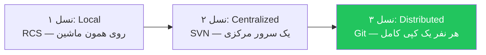
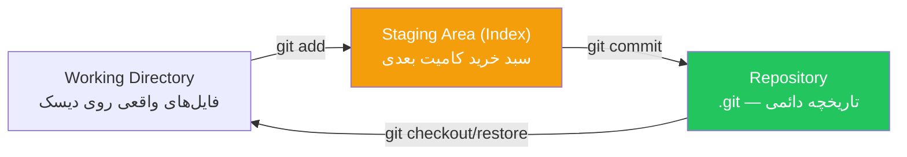
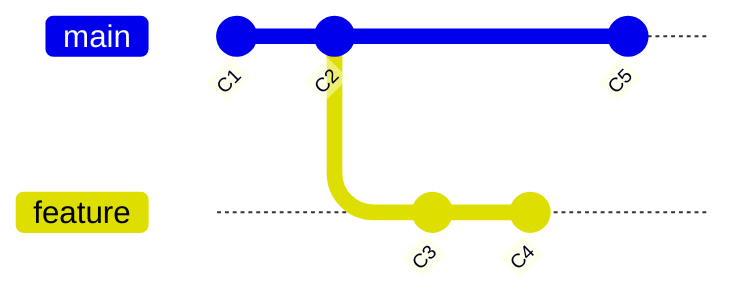

# فصل ۱ — گیت چیست و چرا؟ (مدل ذهنی درست)

> 🎯 **هدف این فصل:** قبل از دستورات، مدل ذهنی درست رو بسازیم. ۹۰٪ استرس گیت از اینه که آدم نمی‌دونه «زیر hood چه خبره». آخر این فصل، کامیت رو دیگه «یک دکمه» نمی‌بینی؛ یک **snapshot با شناسه** می‌بینی — و همه‌چیز ساده می‌شه.

---

## ۱.۱ — مسئله‌ای که گیت حلش می‌کنه

همه برنامه‌نویسان در شروع کار این سناریو را تجربه کرده‌اند: ساخت فایل‌هایی مثل inal.js، inal2.js، inal-really-final.js و سردرگمی میان نسخه‌ها. گیت مانند «**Time Machine کد**» عمل می‌کند — هر کامیت یک عکس لحظه‌ای (Snapshot) پایدار از کل پروژه است که می‌توان به آن بازگشت، آن را با سایر نسخه‌ها مقایسه کرد و به صورت همزمان همراه سایر اعضای تیم روی آن کار کرد.

| بدون VCS | با گیت |
|---|---|
| کپی پوشه با اسم تاریخ‌دار | هر کامیت = snapshot با نام و پیام |
| «کدوم نسخه جدیدتره؟» | تاریخچه کامل قابل جستجو |
| همکاری = فایل جابجایی با فلش! | merge و branch و PR |
| «دیروز کار می‌کرد، الان خرابه!» | diff دقیق بین هر دو لحظه |
| اشتباه = از دست رفتن کد | تقریباً همه چیز قابل برگشت |

VCS ها سه نسل داشتن — فهمیدنش کمک می‌کنه بفهمی گیت چرا این‌شکلیه:



**گیت توزیع‌شده (Distributed) است:** کل تاریخچه پروژه به صورت محلی روی سیستم هر توسعه‌دهنده قرار دارد. بدون اینترنت هم می‌توان کامیت زد، branch ساخت و تاریخچه را دید. گیت‌هاب فقط «فضای اشتراک و ریموت» است — گیت‌هاب ≠ گیت! (فصل ۱۰ به تفصیل بررسی می‌شود).

> 💡 گیت رو Linus Torvalds (خالق لینوکس) در ۲۰۰۵ ساخت — اول برای مدیریت کدِ خود لینوکس. اسمش به معنی «آدم مزاحم/زورگو» به انگلیسی عامیانه است — شوخی خودش. امروز استاندارد بی‌رقیب صنعت است و **Git 2.55** آخرین نسخه پایدارش است (و Git 3.0 در راه است که SHA-256 رو پیش‌فرض می‌کنه — برای کار روزمره‌ات هیچ فرقی نمی‌کنه).

---

## ۱.۲ — مهم‌ترین حقیقت: کامیت = Snapshot، نه Diff

این جمله رو قاب کن: **«گیت به snapshot فکر می‌کنه، نه تغییرات.»**

هر کامیت یک **عکس کامل از کل پروژه** در اون لحظه است (به صورت بهینه: فایل‌های تغییریافته جدید ذخیره می‌شن، بقیه به snapshot قبلی اشاره می‌کنن). نتیجه جادویی:

```
C1 ← C2 ← C3 ← C4   (هر C یک کامیت)
```

هر کامیت:
- یک **SHA** یکتا دارد: `a1b2c3d...` (مثل اثر انگشت از محتوا — هش SHA-1)
- به کامیت **قبل** از خودش اشاره می‌کنه (پدر)
- دارد: author، تاریخ، و **پیام**

یعنی تاریخچه یک **زنجیره** است. هر چیزی که بهش SHA بدی، همون لحظه رو exact برمی‌گردونی. این پایه «برگشت‌ناپذیر نبودنِ ترس‌ها» است: کامیت زده‌ای؟ برای همیشه اونجاست، حتی اگه بترکونیش (فصل ۶: reflog).

---

## ۱.۳ — سه ناحیه: جایی که ۹۹٪ سردرگمی‌ها شروع می‌شه

وقتی کار می‌کنی، کدت در یکی از این سه ناحیه است:



| ناحیه | چیه | شبیه به |
|---|---|---|
| **Working Directory** | فایل‌هایی که الان ویرایش می‌کنی | میز کارت |
| **Staging Area** | «چه فایل‌هایی در کامیت بعدی برن» — انتخاب دستی تو | سبد خرید فروشگاه 🛒 |
| **Repository** | کامیت‌های ثبت‌شده، داخل پوشه مخفی `.git` | انبار امن |

چرا staging جدا داریم؟ چون می‌خوای **دقیقاً انتخاب کنی** چه چیزی توی کامیت بره. مثلاً دو باگ رو فیکس کردی ولی می‌خوای هر فیکس کامیت جدا بشه (کامیت اتمیک — فصل ۳): فقط فایل‌های مربوط به باگ اول رو add می‌کنی، کامیت می‌زنی، بعد بقیه.

**قانون:** `git add` = «بذار توی سبد». `git commit` = «سبد رو ثبت کن». فایلی که add نشده، در کامیت نیست — هرچقدر هم ویرایشش کردی!

---

## ۱.۴ — HEAD و Branch: اشاره‌گرها، نه فایل‌ها

مفهومی که وقتی بفهمیش، شاخه‌ها برایت معما نمی‌شن:

- **Commit** = یک snapshot با SHA
- **Branch** = فقط یک **اسمِ قابل‌جابجایی که به یک کامیت اشاره می‌کنه** — بس! یک فایل متنی ۴۱ بایتی در `.git/refs/heads/`
- **HEAD** = اشاره‌گر به «الان کجای تاریخچه‌ای» — معمولاً به آخرین کامیت شاخه فعلی



در نمودار بالا: `main` به C5 اشاره می‌کنه و `feature` به C4. «ساختن شاخه» یعنی ساختن یک اشاره‌گر جدید — به همین سادگی و سریعی (نه کپی کل پروژه!). «کامیت زدن» یعنی snapshot جدید + جابجا شدن اشاره‌گر شاخه فعلی به آن.

چکش‌ت رو بردار و خودت ببین (در یک پروژه گیت‌دار):

```bash
cat .git/HEAD
# ref: refs/heads/main        ← HEAD به شاخه main اشاره می‌کند
cat .git/refs/heads/main
# a1b2c3d4e5f6...             ← main = فقط یک SHA!
```

وقتی HEAD مستقیم به یک کامیت اشاره کنه (نه به شاخه)، در حالت **Detached HEAD** هستی — فصل ۱۳ توضیح می‌ده چطوری بی‌دردسر خارج شی.

---

## ۱.۵ — چرا SHA ها مهم‌اند؟

هر کامیت یک SHA کوتاه‌شده دارد مثل `a1b2c3d`. کجاها می‌بینی‌ش:

- `git log` — تاریخچه
- `git show a1b2c3d` — نمایش یک کامیت خاص
- `git checkout a1b2c3d` — سفر در زمان به آن لحظه
- `git diff a1b2c3d..HEAD` — مقایسه دو لحظه

چون SHA از **محتوا** محاسبه می‌شه، اگه کسی تاریخچه رو دستکاری کنه SHA ها عوض می‌شن و دیده می‌شه — یعنی گیت به صورت توکار **تخم‌مرغ‌زنی تاریخچه** رو لو می‌ده. (پایه امنیت گیت و پایه بحث «rebase = بازنویسی تاریخچه» در فصل ۸.)

---

## ۱.۶ — گیت در مقابل گیت‌هاب (و بقیه)

جدولی که خیلی‌ها قاطی می‌کنن:

| | Git | GitHub |
|---|---|---|
| چیه؟ | نرم‌افزار کنترل نسخه (روی سیستم تو نصب می‌شه) | سرویس ابری میزبانی مخزن‌های گیت |
| کجا؟ | لوکال، آفلاین هم کار می‌کنه | ابر — فقط با اینترنت |
| نمونه‌ها | Git، (Mercurial قدیمی) | GitHub، GitLab، Bitbucket |
| نقش برای توسعه‌دهنده | ابزار روزمره کنترل نسخه در ترمینال یا ادیتور | پلتفرم ابری اشتراک کد، میزبانی مخزن، PR ها و CI/CD |

> 📌 گیت‌هاب فقط *یک میزبان* است. همه‌چیزی که در این دوره درباره گیت می‌آموزی (branch, merge, rebase...) در هر شرکت — حتی اونهایی که GitLab یا Bitbucket دارند — یکسانه. فقط PR و CI گیت‌هاب-خاص‌اند.

---

## ✅ جمع‌بندی فصل

- گیت = VCS توزیع‌شده؛ کل تاریخچه لوکال است؛ گیت‌هاب فقط میزبان ابری است
- **کامیت = snapshot کامل** با SHA یکتا و اشاره به پدر — زنجیره تاریخچه
- **سه ناحیه:** Working (میز کار) → `add` → Staging (سبد خرید) → `commit` → Repository (انبار)
- **Branch = اشاره‌گر به یک کامیت** (فایل چندبایتی!) — نه کپی پروژه
- **HEAD = «الان کجایی»**؛ سفر در زمان با SHA ممکنه
- گیت تاریخچه را hash می‌کند — دستکاری لو می‌رود

## 📝 تمرین فصل ۱

1. سه ناحیه گیت را با analogi سبد خرید توضیح بده: `add` چه می‌کند؟ `commit` چه می‌کند؟
2. در یکی از پروژه‌های خودت (که گیت دارد)، `cat .git/HEAD` و سپس محتوای فایل refs را ببین. اسم شاخه‌ات چیه؟ SHA آخرین کامیت؟
3. با دستور git log --oneline ده کامیت آخر یکی از پروژه‌های قبلی خود را مرور کنید. (این تمرین صرفاً برای درک شکل خروجی است؛ از فصل‌های بعد یاد می‌گیرید تاریخچه‌ای استاندارد بسازید).
4. سوال مفهومی: چرا ساختن ۱۰ شاخه در گیت سریع و بی‌هزینه است، ولی در ذهن خیلی‌ها «سنگین» تصور می‌شود؟

<details><summary>جواب‌ها</summary>

1. `add` = گذاشتن کالا در سبد (انتخاب دقیق چیزی که ثبت شود)؛ `commit` = پرداخت و ثبت نهایی سبد در انبار؛ آنچه در سبد نگذاشتی، ثبت نمی‌شود.
2. HEAD معمولاً `ref: refs/heads/main` است و فایل refs فقط یک SHA ۴۰ کاراکتری دارد — یعنی شاخه واقعاً فقط یک اشاره‌گر است.
4. چون شاخه فقط یک فایل ۴۱ بایتی است؛ «سنگین بودن» فقط تصور ذهنی است — یکی از هدف‌های این دوره رفع همین تصور است.
</details>

➡️ **فصل بعد:** نصب، پیکربندی حرفه‌ای و اتصال امن به گیت‌هاب با SSH.
