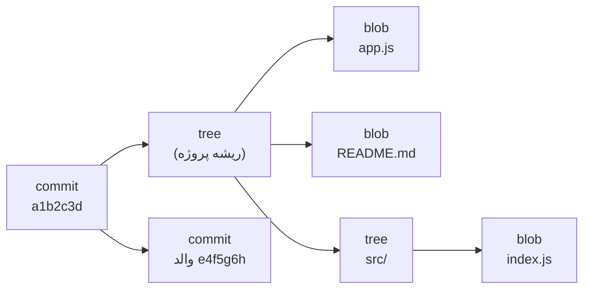
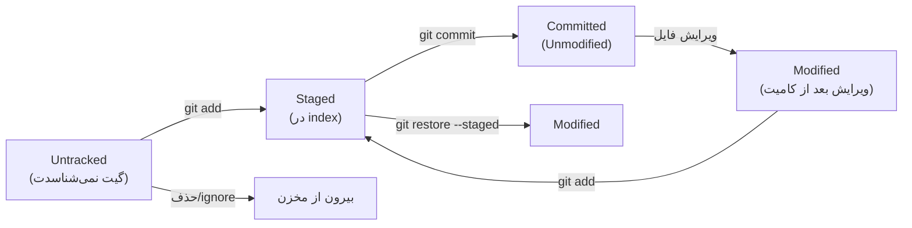

# فصل ۴ — پشت صحنه: گیت واقعاً چطور کار می‌کند؟ (تور .git) 🕳️

> 🎯 **هدف:** بعد از این فصل، وقتی به پوشه `.git` نگاه می‌کنی دیگه جعبه‌سیاه نمی‌بینی. همین فصل تفاوت «کسی که گیت رو حفظ کرده» با «کسی که گیت رو فهمیده» است — هم در حل مشکلات، هم در مصاحبه.

---

## ۴.۱ — چرا زیر پوست گیت بریم؟

سه دلیل کاملاً عملی:
- وقتی چیزی گم می‌شه (`reflog` فصل ۶، `gc`، آبجکت‌های ناقص)، کسی که می‌دونه گیت چی رو کجا ذخیره می‌کنه، ده دقیقه‌ای حلش می‌کنه
- پیام‌های ترسناک مثل `fatal: bad object` یا `index lock` دیگه وحشت‌آور نیستن
- سوال مصاحبه محبوب: «گیت چطور فایل‌ها رو ذخیره می‌کنه؟» — جوابش کل این فصله

## ۴.۲ — تور پوشه `.git`

یادته با `git init` گفته شد «مخزن ساخته شد»؟ مخزن یعنی همین پوشه:

```bash
cd git-playground
ls -F .git/
# HEAD         ← فعلاً یک فایل متنی ساده! (پایین می‌بینیم)
# config       ← تنظیمات این مخزن (چیزهایی که با git config --local می‌زنی)
# hooks/       ← اسکریپت‌های خودکار — فصل ۱۴ بهش می‌پردازیم
# index        ← فایل باینری: همون Staging Area! (بخش ۴.۵)
# objects/     ← 💎 دیتابیس اصلی گیت — همه‌چیز اینجاست
# refs/        ← اشاره‌گرها: شاخه‌ها و تگ‌ها (فقط SHA!)
# info/  description  ...
```

دو تا از این‌ها رو همین حالا باز کن:

```bash
cat .git/HEAD
# ref: refs/heads/main          ← HEAD فقط یک آدرس اشاره‌گر است

cat .git/refs/heads/main
# a1b2c3d4e5f6...               ← شاخه main = یک فایل متنی با یک SHA داخلش!
```

> 🤯 **لحظه‌ی «آهان»:** شاخه‌ای که تا حالا ازش حسابی می‌ترسیدی، فقط یک فایل ۴۱ بایتی متنی است که اسم یک کامیت توشه. ساختن شاخه = ساختن یک فایل کوچک. به همین دلیل شاخه زدن در گیت «ارزون»ه و تشویق می‌شی زیاد بزنی (فصل ۷).

## ۴.۳ — دیتابیس آبجکت‌ها: blob، tree، commit

گیت یک **دیتابیس محتوا-محور (content-addressable)** است: هر چیزی که ذخیره می‌شه، اول هش SHA-1 از *محتواش* گرفته می‌شه و همون هش، آدرسش می‌شه.

خودت امتحان کن — این دستور بدون هیچ مخزنی هم کار می‌کنه:

```bash
echo "hello git" | git hash-object --stdin
# 8ab686eafeb1f44702738c8b0f24f2567c36da6d   ← همین محتوا، همیشه همین هش
```

چهار نوع آبجکت داریم:

| آبجکت | چی ذخیره می‌کنه | مثل... |
|---|---|---|
| **blob** | محتوای یک فایل (بدون نام فایل!) | محتویات جعبه |
| **tree** | یک پوشه: اسم فایل‌ها + اشاره به blob و tree های زیرین | برچسب روی جعبه‌ها |
| **commit** | یک snapshot: اشاره به یک tree + والد (ها) + پیام + author + تاریخ | برگه‌ی ثبت |
| **tag** | فقط برای تگ annotated: اشاره به کامیت + پیام + امضا (فصل ۹) | مهر روی برگه |

ابزارهای X-Ray برای دیدن این‌ها:

```bash
git cat-file -t a1b2c3d    # نوع آبجکت: commit / blob / tree / tag
git cat-file -p a1b2c3d    # محتوای خوانا (p = pretty)
git ls-tree HEAD           # درختِ ریشه: چه فایل‌هایی، با چه blob هایی
git ls-tree HEAD src/      # داخل یک پوشه
git rev-parse main         # SHA کامل یک شاخه
```

خروجی `git cat-file -p HEAD` یک کامیت واقعی شبیه اینه:

```text
tree 4b825dc642cb6eb9a060e54bf8d69288fbee4904
parent e4f5g6h...            ← کامیت قبلی (کامیت اول والد ندارد)
author Sarah Dev <sarah@example.com> 1726300000 +0330
committer Sarah Dev <sarah@example.com> 1726300000 +0330

    feat: add search endpoint
```



> 💡 **نکته کلیدی: چرا گیت rename را خودش تشخیص می‌دهد** — داخل blob نه اسم فایل هست نه مسیرش؛ اسم‌ها در `tree` ذخیره می‌شن. پس وقتی فایلی جابه‌جا می‌شه، محتوای blob رو می‌شناسد و می‌گه «این همون فایل قبلیه، فقط عوض شده جاش» (تمرین فصل ۳).

## ۴.۴ — چرا snapshot ارزون است؟ (dedup)

فصل ۱ گفتیم هر کامیت = snapshot کامل، نه diff. این با «دیتابیس محتوا-محور» جور درمیاد:

- دو فایل با محتوای یکسان (حتی با اسم‌های متفاوت) → **یک blob مشترک**، چون هش‌شون یکیه
- در کامیت جدید، فایل‌هایی که تغییر نکردن → کامیت جدید فقط به **همان blob های قبلی** اشاره می‌کنه

پس پروژه‌ی ۵۰ مگابایتی با هزار کامیت، ۵۰ گیگ نمی‌شه — فقط محتوای *عوض‌شده* دوباره ذخیره می‌شه. snapshot بودن، هم به سرعت `switch` و `reset` کمک می‌کنه (کپی دیتابیس لازم نیست، فقط اشاره‌گرها جابه‌جا می‌شن) هم به سبک ماندن مخزن روی دیسک.

## ۴.۵ — index: Staging Area از نگاه گیت

اونا فایل باینری `.git/index` — چیزی که اسمش staging area است — یک «قرارِ snapshot بعدی» است: لیستِ دقیقِ این‌که در کامیت بعدی چه محتوایی با چه اسمی باشد.

سه دستور پایه، سه حرکت زیر پوست:

| دستور | در چشم گیت |
|---|---|
| `git add app.js` | محتوا → یک blob جدید در `objects/` + ثبتش در index |
| `git commit` | از index یک `tree` بساز + یک آبجکت `commit` به آن + جلو بردن اشاره‌گر شاخه (یعنی `refs/heads/main` = SHA جدید) |
| `git restore --staged app.js` | فقط ورودی app.js را از index حذف کن (blob در objects می‌ماند — بی‌ضرر) |

و چرخه حالت‌های فایل — همون جدولی که بهش ارجاع زیاد می‌دیم:



> 🎯 وقتی `status` می‌گیری، گیت در واقع دو مقایسه می‌کنه: **index در برابر آخرین کامیت** (فایل‌های Staged) و **working directory در برابر index** (فایل‌های Modified/Untracked). حالا دیگه می‌دونی چرا «سه ناحیه» سه‌تاست.

## ۴.۶ — packfile، `git gc` و هوای تازه دادن به مخزن

آبجکت‌های تکی (loose objects) هر کدوم یک فایل جدا در `objects/` هستند. گیت وقتی تعدادشون زیاد می‌شه (یا موقع push)، اون‌ها رو **فشرده و بسته‌بندی** می‌کنه: `objects/pack/*.pack` — به‌علاوه diff های محاسبه‌شده بین blob های مشابه (delta compression). برای همین مخزن‌های بزرگ خیلی کوچک‌تر از جمع فایل‌هاشونند.

نگهبان این چرخه:

```bash
git count-objects -vH      # آمار: چند آبجکت loose، چند pack، حجم
git gc                     # ⭐ garbage collection: فشرده‌سازی + پاکسازی
git gc --prune=now         # همین حالا آبجکت‌های بی‌مرجع را هم پاک کن
```

- گیت خودش گاه‌گاهی (بعد از عملیات‌های حجیم) `gc` خودکار می‌زنه — معمولاً لازم نیست دستی بزنی
- `gc` آبجکت‌های «بی‌مرجع» رو پاک می‌کنه؛ ولی reflog ها (فصل ۶) یک مهلت نگه‌داری دارن (پیش‌فرض ~۳۰/۹۰ روز) — یعنی «کامیت گم‌شده» معمولاً هنوز نجات‌پذیره، وگرنه عمر reflog هم محدوده
- `git fsck --lost-found` جاروی آخری برای پیدا کردن آبجکت‌های یتیم (اگر reflog هم پاک شده بود)

> 🚨 **قانون خانه‌داری:** داخل `.git` هیچ‌وقت دستی چیزی پاک یا ویرایش نکن — کل استثنا: پوشه `hooks/` (فصل ۱۴) و دستورات رسمی مثل `gc`. تمیزکاری با گیت انجام می‌شه، نه با Explorer.

---

## ✅ جمع‌بندی فصل

- مخزن = پوشه `.git`: دیتابیس `objects/` + اشاره‌گرهای `refs/` + فایل `index` + `HEAD`
- شاخه = یک فایل متنی حاوی SHA؛ ساخت شاخه ارزون است چون فقط اشاره‌گر ساخته می‌شه
- ۴ نوع آبجکت: blob (محتوا)، tree (پوشه)، commit (snapshot+والد)، tag (مهر annotated)
- هش از محتوا: محتوای یکسان → blob مشترک (dedup) → snapshot ها ارزون‌اند
- `add` = ساخت blob و ثبت در index؛ `commit` = ساخت tree و commit و جلو بردن شاخه
- `git gc` بسته‌بندی و پاکسازی می‌کند؛ داخل `.git` دست‌کاری ممنوع (به‌جز hooks)

## 📝 تمرین فصل ۴ (همه در زمین تمرین — ریسک صفر)

1. در `.git` تور بزن: `cat .git/HEAD` و `cat .git/refs/heads/main` — بعد `git rev-parse main` بزن و مقایسه کن. برابره؟
2. دو فایل با محتوای یکسان ولی اسم متفاوت بساز، هر دو را add کن، بعد `git ls-files -s` بزن — چرا فقط یک SHA می‌بینی؟
3. `git cat-file -t <sha>` و `git cat-file -p <sha>` را روی کامیت آخر، روی tree آن، و روی یکی از blob هایش اجرا کن (زنجیره commit → tree → blob را دستی دنبال کن).
4. `git count-objects -vH` بزن، چند کامیت بزن، دوباره بزن؛ بعد `git gc` و دوباره مقایسه کن — حجم چطور شد؟
5. (چالش) بدون `git switch` و بدون checkout: با `git cat-file -p <sha-یکی-کامیت-قدیمی>` محتوای یک فایل در آن نسخه را ببین.

<details><summary>جواب تمرین ۲ و ۵</summary>

```bash
# تمرین ۲:
git ls-files -s
# 100644 8ab686ea 0  app.js
# 100644 8ab686ea 0  copy-of-app.js    ← همان SHA! یک blob، دو اسم (هر دو در index)
# چون هش از «محتوا» است و محتواها یکی‌اند، گیت فقط یک blob نگه می‌دارد.

# تمرین ۵:
git log --oneline            # SHA کامیت قدیمی موردنظر
git cat-file -p <sha>        # خط tree را کپی کن
git cat-file -p <tree-sha>   # SHA فایل (blob) را پیدا کن
git cat-file -p <blob-sha>   # ← محتوای فایل در آن نسخه، بدون جابه‌جایی شاخه!
```
</details>

➡️ **فصل بعد:** حالا که می‌دونی تاریخچه یعنی زنجیره آبجکت‌ها، یاد می‌گیریم مثل حرفه‌ای‌ها ازش جست‌وجو بزنیم — `git log` نسخه کامل.
