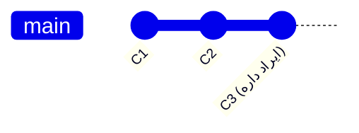
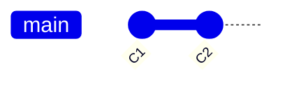
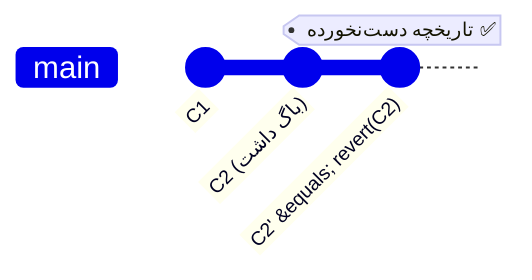

# فصل ۶ — برگرداندن‌ها: بدون ترس! (restore، reset، revert، reflog)

> 🎯 **هدف:** بزرگ‌ترین منبع استرس گیت، «ترس از خراب کردن» است. این فصل جدول تصمیم کامل undo رو بهت می‌ده و reflog رو یادت می‌ده — ابزاری که عملاً یعنی «هیچ کامیت‌ای گم نمی‌شه».

---

## ۶.۱ — جدول تصمیم: چه چیزی رو می‌خوام برگردونم؟

قبل از هر دستوری، خودت رو از این سوال رد کن:

| وضعیت | راه‌حل | ایمنی |
|---|---|---|
| ویرایش فایل رو پشیمونم (هنوز add نشده) | `git restore file` | ⚠️ تغییر برای همیشه می‌ره |
| فایل رو اشتباه add کردم | `git restore --staged file` | ✅ بی‌خطر — فقط از سبد خارج می‌شه |
| آخرین کامیت پیامش/محتواش ایراد داره | `git commit --amend` | ✅ فقط قبل از push |
| کامیت آخر رو کلاً نمی‌خوام، کد کارم بمونه | `git reset --soft HEAD~1` | ✅ تغییرات staged می‌مونه |
| کامیت **push شده** اشتباهه (تاریخچه مشترک!) | `git revert` | ✅ کامیت معکوس — امن برای تیم |
| یه کامیت قدیمی رو باید بی‌خیال شم | `git revert <sha>` | ✅ |
| «بروم یه چیز رو امتحان کنم» | `git switch -c experiment` | ✅ شاخه! بهترین undo دنیا |

---

## ۶.۲ — restore: برگرداندن فایل‌ها

```bash
# ویرایش‌های working directory این فایل رو برگردون به آخرین کامیت
git restore app.js

# فایل رو از سبد کامیت خارج کن (فقط unstage — کدت دست نمی‌خوره!)
git restore --staged app.js

# هر دو با هم: برگرد به وضعیت آخرین کامیت
git restore --staged --worktree app.js
```

> 🚨 تنها دستور «خطرناک» این خانواده، `restore` روی worktree است: ویرایش‌های ذخیره‌نشده واقعاً می‌پرن. اگه مطمئن نیستی، اول شاخه بزن (بخش ۶.۵) یا `git stash` کن (فصل ۹).

## ۶.۳ — reset: جابجایی شاخه (سه حالت)

`git reset` شاخه فعلی رو به یک کامیت دیگه **می‌بَره**. سوال اینه: کارهای میانی چی بشن؟ سه حالت:

```bash
git reset --soft HEAD~1    # شاخه می‌ره عقب؛ تغییرات: staged می‌مونه
git reset HEAD~1           # (mixed — پیش‌فرض) تغییرات: توی working directory
git reset --hard HEAD~1    # ⚠️ همه چیز پاک! به کامیت قبل برگرده، هیچی نمونه
```

تصویری برای `HEAD~1` (کامیتِ قبل از HEAD):



بعد از `git reset --soft HEAD~1`:



| حالت | Repository | Staging | Working |
|---|---|---|---|
| `--soft` | می‌ره عقب | ✅ می‌مونه | ✅ می‌مونه |
| `--mixed` (پیش‌فرض) | می‌ره عقب | خالی می‌شه | ✅ می‌مونه |
| `--hard` | می‌ره عقب | خالی | ⚠️ پاک می‌شه |

سناریوی واقعی: «سه کامیت اول صبح رو قاطی زدم، می‌خوام همه رو یک کامیت تمیز بزنم»:

```bash
git reset --soft HEAD~3          # هر سه کامیت لغو شد، اما تغییرات کد در حالت Staged باقی ماند
git commit -m "feat(auth): complete login flow with tests"
```

> ⚠️ **قانون طلایی reset:** هرگز روی شاخه‌ای که push شده و بقیه روش کار می‌کنن، reset نزن — تاریخچه رو بازنویسی می‌کنه و push بعدی باید force بشه (فصل ۸: قانون طلایی rebase — همین قانونه).

## ۶.۴ — revert: «برگردنِ امن» برای تاریخچه مشترک ⭐

`revert` تاریخچه رو نمی‌شکنه: یک **کامیت جدیدِ معکوس** می‌سازه که اثر کامیت هدف رو خنثی می‌کنه:

```bash
git revert a1b2c3d        # ادیتور باز می‌شه: پیام "Revert '...'" رو تأیید کن
git revert --no-edit a1b2c3d
```



فرق با reset یک‌خطی است: **reset تاریخچه رو بازنویسی می‌کنه (لوکال/شخصی)، revert بهش اضافه می‌کنه (عمومی/مشترک).** در شرکت، روی شاخه‌های مشترک فقط revert!

```bash
# revert یک merge commit (مثلاً PR اشتباهی merge شده) — با m مشخص کن کدوم والد نگه داشته شه:
git revert -m 1 <merge-sha>
```

## ۶.۵ — reflog: بیمه زندگی ⭐⭐

این بخش رو خوب بخون، چون همین‌جاست که «ترس گیت» می‌میره.

گیت یک **ژورنال حرکات HEAD** نگه می‌داره — حتی reset های hard و rebase ها رو:

```bash
git reflog
# a1b2c3d (HEAD -> main) HEAD@{0}: reset: moving to HEAD~1
# e4f5g6h HEAD@{1}: commit: feat: add search          ← کامیت «گم‌شده»!
# i7j8k9l HEAD@{2}: checkout: moving from main
```

کامیت‌هایت تا **~۹۰ روز** در `.git` زنده‌ان حتی اگه هیچ شاخه‌ای بهشون اشاره نکنه. برگردوندنش:

```bash
git reset --hard e4f5g6h      # یا: git reset --hard HEAD@{1}
```

همین. «کامیت‌م رو با reset --hard پاک کردم!» — نه، فقط اشاره‌گر بردی؛ reflog برش می‌گردونه.

> 💡 پیش‌نمایش فصل ۱۳: **وقتی نالا و استرس‌زاست (مثلاً وسط جلسه با لید)، اول `git reflog` بزن.** تقریباً هر فاجعه‌ای با این یکی دستور خنثی می‌شه. نفس عمیق، بعد reflog.

## ۶.۶ — پاکسازی فایل‌های بی‌ردیب

```bash
git clean -n      # Dry-run: چه فایل‌هایی untracked حذف خواهند شد؟
git clean -fd     # حذف واقعی فایل‌ها و پوشه‌های untracked
```

⚠️ `clean` برخلاف بقیه گیت، **برگشت‌ناپذیره** (untracked ها هیچ snapshot ای ندارن). همیشه اول `-n`.

---

## ✅ جمع‌بندی فصل

- جدول تصمیم رو حفظ کن: پشیمونی ویرایش → restore؛ اشتباه add → restore --staged؛ اصلاح → amend؛ کامیت لوکال اضافه → reset --soft؛ کامیت مشترک → **revert**
- reset سه حالت: soft (همه‌چیز می‌مونه)، mixed (unstage)، hard (پاک — خطرناک)
- **revert = کامیت معکوس؛ تنها راه امن برگردوندن روی شاخه‌های push شده**
- **reflog = بیمه زندگی** — هیچ کامیت ≈۹۰ روز از بین نمی‌ره
- `git clean` تنها برگشت‌ناپذیره — همیشه `-n` اول

## 📝 تمرین فصل ۶ (در زمین تمرین — جرئت داری، خراب می‌کنی برمی‌گردونی!)

1. سه کامیت بزن. آخرینش رو با `reset --soft` بردار، بعد با پیام Conventional دوباره بزن.
2. یک کامیت رو `revert` کن و با `git lg` ببین چه اتفاقی افتاد (تاریخچه چند خط شد؟).
3. یک کامیت بزن، `reset --hard HEAD~1` بزن (کامیت «پاک» شد!)، حالا با `git reflog` پیداش کن و برگردونش. این تمرین رو تا جایی تکرار کن که «ترس»ت بره 😎
4. سوال: همکارت روی main مشترک push کرده و فهمیدن کامیت وسطی باگ داره. reset یا revert؟ چرا؟

<details><summary>جواب تمرین ۳</summary>

```bash
echo x > f.txt && git add f.txt && git commit -m "test: will be lost"
git reset --hard HEAD~1
git lg --oneline -2        # کامیت نیست!
git reflog -5              # SHA کامیت را اینجا پیدا کن
git reset --hard <SHA>
git lg --oneline -2        # برگشت ✅
```
تمرین ۴: **revert** — چون کامیت push شده و تاریخچه مشترکه؛ reset نیازمند force push است و کاری بقیه رو خراب می‌کنه.
</details>

➡️ **فصل بعد:** قلب همکاری: شاخه‌ها، merge و — بدون ترس — حل تعارض.
