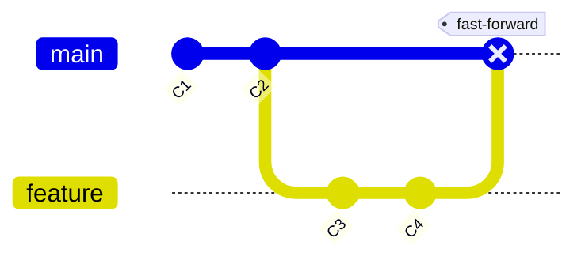
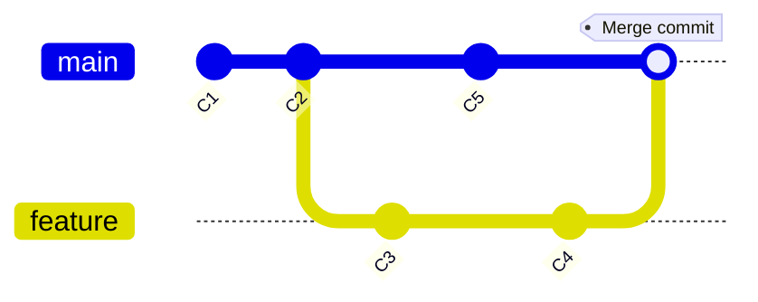

# فصل ۷ — شاخه‌ها، Merge و حل تعارض (بدون استرس!)

> 🎯 **هدف:** شاخه = کارت اعتباری رایگان. یاد می‌گیری چطور شاخه بزنی، merge کنی، و مهم‌تر از همه: **merge conflict رو قدم‌به‌قدم و آروم حل کنی** — همون چیزی که خیلی‌ها رو می‌ترسونه ولی در عمل یک کار مکانیکیه.

---

## ۷.۱ — چرا شاخه؟

سناریوی شرکت: روی `main` نسخه پایدار هست. تو باید فیکس کنی، همکارت فیچر می‌سازه، و ناگهان باگ حیاتی production گزارش می‌شه. بدون شاخه؟ فاجعه. با شاخه؟ هر کسی توی دنیای خودش:

- **عایق‌سازی:** کار نیمه‌تمامت به main لطمه نمی‌زنه
- **موازی‌کاری:** چند کار همزمان، چند نفر
- **بازبینی:** کار هر فیچر جدا قابل ریویو (PR — فصل ۱۱)
- **بازگشت:** فیچر شکست خورد؟ شاخه‌ش رو پاک کن، main سالمه

قاعده شرکت‌ها: **هیچ‌وقت مستقیم روی main کامیت نزن** (main معمولاً protected هم هست). همیشه `feature/*` یا `fix/*`.

## ۷.۲ — دستورات مدرن: `switch` و `branch`

دستورات مدرن گیت (از ۲.۲۳ به بعد) کار checkout رو به دو دستور روشن تقسیم کرده — از همینا استفاده کن:

```bash
git branch                      # لیست شاخه‌ها (* = الان کجام)
git switch -c feature/search    # ساخت + پرش به شاخه جدید (-c = create)
git switch main                 # برگشت به main
git switch -                    # برگشت به شاخه قبلی (مثل cd -)
git branch -d feature/search    # حذف شاخه merge‌شده
git branch -D feature/search    # حذف اجباری (کامیت‌های merge‌نشده می‌پرن — با reflog نجات پیدا می‌کنن!)
```

> 💡 نام‌گذاری رایج در شرکت‌ها: `feature/checkout-discount`، `fix/login-404`، `hotfix/urgent-payment`، `chore/deps-update`. از نام‌های نامشخص و شخصی مانند (`temp-work` یا `test-branch`) پرهیز کنید — محتوای کار رو اسم کن.

## ۷.۳ — Merge: دو خط تاریخچه یکی می‌شن

سناریوی زمین تمرین:

```bash
git switch -c feature/greeting
echo "console.log('hello')" > greet.js
git add . && git commit -m "feat: add greeting module"
git switch main
echo "v2" > version.txt
git add . && git commit -m "chore: bump version"
git merge feature/greeting
```

دو حالت merge وجود داره — دیدنش کلید فهم همه‌چیز است:

### حالت ۱: Fast-forward

اگه از انشعاب main ثابت بوده (هیچ کامیت جدیدی نداشته)، گیت فقط اشاره‌گر رو جلو می‌بَره:



### حالت ۲: Merge commit (سه‌طرفه)

اگه هر دو طرف کامیت جدید داشتن، گیت یک **کامیت merge** می‌سازه که دو والد داره:



> 💡 در گیت‌هاب (PR) همیشه merge commit ساخته می‌شه (مگر strategy دیگه — فصل ۱۱). پس تصویر دوم، ظاهر استاندارد تاریخچه شرکت‌هاست.

## ۷.۴ — Merge Conflict: رودررویی بی‌خطر 😌

تعارض وقتیه که **دو نفر یک خط یکسان رو متفاوت** تغییر دادن — گیت نمی‌دونه کدوم حق داره و از تو می‌پرسه. این یک ارور نیست؛ یک سوال مودبانه‌ست!

بسازیمش (زمین تمرین):

```bash
git switch -c feature/tagline
echo "بهترین فروشگاه" > tagline.txt
git add . && git commit -m "feat: tagline from feature"

git switch main
echo "فروشگاه شماره یک" > tagline.txt
git add . && git commit -m "feat: tagline on main"

git merge feature/tagline
# CONFLICT (content): Merge conflict in tagline.txt
# Automatic merge failed; fix conflicts and then commit the result.
```

حالا `git status` بگو: `both modified: tagline.txt`. فایل رو باز کن:

```
<<<<<<< HEAD
فروشگاه شماره یک
=======
بهترین فروشگاه
>>>>>>> feature/tagline
```

### حل تعارض قدم‌به‌قدم (آیین‌نامه رسمی آرومی):

**۱. نفس بکش — هیچی از دست نرفته.** merge ناتمام رو با `git merge --abort` هر لحظه می‌تونی لغو کنی و به وضعیت قبل برگردی.

**۲. فایل‌های متعارض رو باز کن** (`git status` لیستشون رو می‌ده). سه بخش رو بخون: `<<<<<<<` تا `=======` = نسخه فعلی (HEAD)؛ `=======` تا `>>>>>>>` = نسخه شاخه دیگر.

**۳. تصمیم بگیر:** یکی رو نگه دار، یا هر دو رو ادغام کن، یا با همکارت (که اون کد رو نوشته!) هماهنگ شو — این مهم‌ترین قدمه: **تعارض یعنی دو تصمیم محصولی به هم خوردن؛ حلش کار فنی+انسانیه.**

**۴. نشان‌ها رو پاک کن** و فایل رو به شکل نهایی دربیار:

```
فروشگاه شماره یک — بهترین انتخاب شما
```

**۵. علامت‌گذاری حل:**

```bash
git add tagline.txt
git status        # ببین همه متعارض‌ها حل شدن
git commit        # گیت پیام merge آماده داره — تأیید کن
```

**۶. قبل از commit، تست کن که کد واقعاً کار می‌کنه** (build/run) — تعارض حل‌شدهٔ ظاهری، باگ پنهان می‌سازه.

### ابزار کمکی VS Code

VS Code بالای بخش متعارض دکمه‌های **Accept Current / Accept Incoming / Compare** می‌ذاره — ولی توصیه: اول چند بار دستی نشان‌ها رو بخون و پاک کن تا «بدنی» درکش کنی؛ بعد از ابزار استفاده کن.

```bash
# دیدن لیست دقیق فایل‌های متعارض:
git diff --name-only --diff-filter=U
# عقب‌نشینی کامل از merge:
git merge --abort
```

> 🧘 **ضد استرس:** تعارض داده‌هات رو پاک نمی‌کنه — هر دو نسخه توی فایله و تاریخچه کامله. بدترین اتفاق ممکن: فایل رو به هم بریزی و commit اشتباه بزنی → هنوز با `git reflog` و `git reset` برمی‌گردی (فصل ۶!).

## ۷.۵ — حذف و مرتب‌کاری بعد از merge

```bash
git branch -d feature/tagline    # شاخه merge‌شده دیگر لازم نیست
git lg                           # با گراف، شکل نهایی رو ببین
```

---

## ✅ جمع‌بندی فصل

- همیشه روی `main` مستقیم کار نکن؛ `feature/*` بزن — نام‌گذاری معنادار
- دستورات مدرن: `switch -c` (ساخت+پرش)، `switch -` (برگشت)، `branch -d` (حذف امن)
- merge دو صورت داره: fast-forward (خط مستقیم) و merge commit (دو والد)
- **تعارض = سوال، نه ارور.** آیین: بخون → تصمیم بگیر (با همکارت!) → نشان‌ها رو پاک کن → add → commit → تست
- `git merge --abort` دکمه لغو همیشگیه — هر زمان می‌تونی عقب‌نشینی کنی

## 📝 تمرین فصل ۷

1. زمین تمرین: شاخه `feature/colors` بزن، فایل `theme.css` بساز و کامیت کن؛ برگرد main، همون فایل رو با محتوای متفاوت بساز و کامیت کن؛ merge کن و تعارض رو دستی حل کن (بدون ابزار!). بعد با `git lg` شکل merge commit رو ببین.
2. `git branch -d` روی شاخه‌ای که merge نشده بزن — پیامش رو بخون. بعد با `-D` حذفش کن و با reflog کامیت‌هاش رو پیدا کن.
3. سوال: همکارت گفته «main رو آپدیت کردم» — تو داری روی `feature/x` کار می‌کنی و می‌خوای تغییرات جدید main رو هم داشته باشی. چیکار می‌کنی؟ (راهنمایی: merge یا rebase — فصل ۸ تصمیمش رو می‌دیم.)

<details><summary>جواب تمرین ۲</summary>

```bash
git switch -c temp-work
echo hi > t.txt && git add . && git commit -m "test: temp"
git switch main
git branch -d temp-work
# error: The branch 'temp-work' is not fully merged. ← گیت محافظت می‌کند!
git branch -D temp-work          # حذف اجباری
git reflog | grep temp           # یا: git log --oneline --reflog
git reset --hard <SHA-found>     # نجات کامیت‌ها (یا ساخت شاخه از آنجا)
git switch -c temp-restored
```
</details>

➡️ **فصل بعد:** rebase و interactive rebase — تاریخچه‌ای که آدم خجالت نمی‌کشه نشونش بده.
