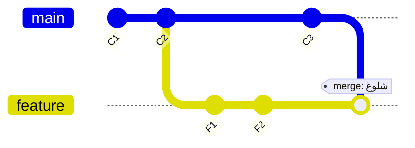
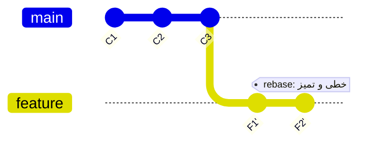

# فصل ۸ — Rebase و هنر تاریخچه تمیز

> 🎯 **هدف:** rebase — مفهومی که تو مصاحبه‌ها همیشه می‌پرسن و در تیم‌ها هر روز استفاده می‌شه. آخر فصل می‌دونی **کی merge و کی rebase**، و با interactive rebase کامیت‌های قاطی‌پات رو تمیز می‌کنی.

---

## ۸.۱ — Rebase چیست؟

مشکل آشنا: داری روی `feature/x` کار می‌کنی؛ همکات main رو جلو برده. تو می‌خوای کارت «روی جدیدترین main» باشه. دو راه:

**راه الف — merge (فصل قبل):** تغییرات main رو به شاخه‌ت بیار → تاریخچه پر از merge commit های «Merge branch 'main' into feature/x».

**راه ب — rebase:** کامیت‌های تو رو **بکن** (کندن = pull up) و روی نوک جدید main دوباره بکار → تاریخچه خطی و تمیز، انگار از اول روی main جدید کار می‌کردی:





> ⚠️ دقت کن: در rebase، کامیت‌های تو (F1', F2') **کاملاً جدیدن** — SHA های متفاوت با همون محتوا. یعنی rebase = **بازنویسی تاریخچه**. این نکته، کل بحث ایمنی این فصله.

استفاده روزمره:

```bash
git switch feature/x
git rebase main        # «کامیت‌های شاخه جاری را روی آخرین کامیت شاخه main منتقل کن»

# اگر تعارض پیش اومد — مثل merge حل می‌شه، ولی مرحله‌ای:
# ۱. فایل‌ها رو درست کن
git add file.js
git rebase --continue     # تا کامیت بعدی برو (یا --abort برای عقب‌نشینی کامل)
```

## ۸.۲ — قانون طلایی rebase 🏆

> **هیچ‌وقت روی شاخه‌ای که به مخزن مشترک push شده، rebase نزن.**

چرا؟ چون rebase کامیت‌ها رو با SHA جدید می‌سازه. اگر بقیه نسخه قدیمی رو pull کرده باشن، تاریخچه‌ها از هم جدا می‌افتن و push تو باید **force** بشه — یعنی کار بقیه رو زیر پا می‌ذاری.

| شاخه | بازنویسی (rebase/amend)؟ |
|---|---|
| `feature/x` که فقط تو داری و هنوز merge نشده | ✅ آزادی کامل |
| `main` یا شاخه‌های مشترک/protected | ❌ هرگز |
| کامیت‌های push شده که دیگران ممکنه کشیده باشن | ❌ هرگز |

به همین دلیل الگوی استاندارد PR اینه:

```bash
# قبل از باز کردن PR — تاریخچه خودت رو تمیز کن:
git rebase -i main          # کامیت‌های خودم را مرتب/ادغام کن
git switch main && git pull # main را تازه کن
git switch feature/x
git rebase main             # روی تازه‌ترین main بنشین
git push --force-with-lease # فقط روی شاخه شخصی خودم! (پایین‌تر توضیح)
```

> 💡 `--force-with-lease` به جای `--force` ساده: فقط اگه ریموت همون چیزی باشه که تو دیدی، بازنویسی کن. اگه همکارت وسط راه چیزی push کرده باشه، گیت جلوت رو می‌گیره. عادت کن همیشه with-lease.

## ۸.۳ — Interactive Rebase: کارگاه جراحی تاریخچه 🔧

قشنگ‌ترین ابزار گیت. با کامیت‌های نمونه شروع کن:

```bash
git lg -5
# a1b2c3d (HEAD -> feature) feat: add search endpoint
# e4f5g6h fix: typo
# i7j8k9l fix: typo again
# m0n1o2p wip
# p3q4r5s (main) chore: bump deps
```

سه کامیت وسط قشنگ نیستن. جراحی کنیم:

```bash
git rebase -i p3q4r5s     # یا: git rebase -i HEAD~4
```

ادیتور باز می‌شه با لیست کامیت‌ها **از قدیم به جدید**:

```
pick m0n1o2p wip
pick i7j8k9l fix: typo again
pick e4f5g6h fix: typo
pick a1b2c3d feat: add search endpoint
```

دستورها رو عوض کن:

| دستور | کار |
|---|---|
| `pick` / `p` | همین‌طور نگه دار |
| `reword` / `r` | نگه دار ولی پیامش رو عوض کن |
| `edit` / `e` | نگه دار ولی محتواش رو هم ویرایش کنم |
| `squash` / `s` | با کامیت قبلی **ادغام** (پیام‌ها ترکیب می‌شن) |
| `fixup` / `f` | با قبلی ادغام و پیامش دور انداخته شه ⭐ |
| `drop` / `d` | کاملاً حذف |
| جابجایی خط‌ها | ترتیب کامیت‌ها عوض می‌شه |

نسخه تمیز‌شده:

```
pick m0n1o2p wip
reword m0n1o2p              ← پیام wip رو درست کن
fixup i7j8k9l               ← typo ها در wip حل می‌شوند
fixup e4f5g6h
pick a1b2c3d feat: add search endpoint
```

نتیجه: دو کامیت تمیز به جای چهار کامیت پراکنده. **این همون کاریه که قبل از باز کردن PR انجام می‌دی** — ریویوچی فقط کار مرتب می‌بینه.

> 🚨 اگر وسط interactive rebase گیج شدی: `git rebase --abort` — همه چیز به قبل برمی‌گرده (و حتی اگر کامل شد، reflog هست). جراحی تاریخچه = عملی که همیشه دکمه لغو داره.

## ۸.۴ — cherry-pick: برداشتن یک کامیت خاص

سناریوی واقعی: فیکس حیاتی روی شاخه دیگه‌ست (یا از main باید به شاخه release منتقل شه — backport):

```bash
git switch release/1.4
git cherry-pick a1b2c3d     # فقط «همون» کامیت را اینجا تکرار کن
# تعارض هم ممکنه — مثل merge حلش کن: add + cherry-pick --continue
```

## ۸.۵ — merge یا rebase؟ (جدول تصمیم)

| موقعیت | انتخاب |
|---|---|
| کامیت‌های محلی شاخه ویژگی قبل از ارسال PR | **rebase -i** (تمیز کردن) |
| انتقال آخرین تغییرات شاخه اصلی (main) به شاخه جاری | rebase (تاریخچه خطی) — یا merge، بسته به قرارداد تیم |
| ادغام نهایی PR در main | merge (در گیت‌هاب — فصل ۱۱) |
| کامیت روی شاخه مشترک push شده | ❌ هیچ بازنویسی‌ای — فقط جلو |

> 💡 تیم‌ها قراردادشون متفاوته: بعضی «merge only»، بعضی «rebase to keep linear». **سوال مهم روز اول: «workflow گیت‌تون چیه — merge می‌کنید یا squash؟»** این سوال خودش نشون می‌ده تو روحیه تیمی بلدی!

---

## ✅ جمع‌بندی فصل

- rebase = کندن کامیت‌های خودت و بکار دوباره روی نوک شاخه مبنا → تاریخچه خطی
- rebase **بازنویسی تاریخچه است** — SHA ها عوض می‌شن
- **قانون طلایی:** فقط روی شاخه‌های شخصی/تا-push-نشده؛ هرگز روی مشترک
- force push فقط `--force-with-lease` — و فقط روی شاخه خودت
- `rebase -i`: squash/fixup/reword/drop — ابزار تمیزکاری قبل از PR
- `cherry-pick` برای نقل یک کامیت مشخص
- تعارض در rebase = همان تعارض merge، مرحله‌ای: `add` + `--continue`، و `--abort` همیشه هست

## 📝 تمرین فصل ۸

1. زمین تمرین: شاخه بزن و ۴ کامیت زشت بزن (`wip1`, `wip2`, `typo fix`, `wip3`)، بعد با `rebase -i` تبدیلش کن به ۲ کامیت معنادار با Conventional Commits. خروجی `git lg` قبل و بعد را ببین.
2. سناریوی کامل PR (مهم‌ترین تمرین دوره!): از main شاخه بزن → ۳ کامیت بزن → به main یک کامیت اضافه کن (شبیه‌سازی همکار) → rebase main روی شاخه‌ات → `git push --force-with-lease` (به ریموت خودت — فصل ۱۰ push رو کامل می‌کنه؛ می‌تونی این مرحله رو بعد فصل ۱۰ تکرار کنی).
3. یک کامیت بنویس «fix: currency in invoice» و با cherry-pick به شاخه دیگه‌ش ببر.
4. سوال مصاحبه‌ای: فرق merge و rebase رو در ۳ جمله بگو.

<details><summary>جواب سوال ۴</summary>

«هر دو دستور برای ادغام دو شاخه به کار می‌روند. دستور merge با ساخت یک کامیت ادغام جدید (Merge Commit) با دو والد، تاریخچه واقعی انشعاب را مستند می‌کند. دستور rebase کامیت‌های شاخه جاری را با شناسه‌های SHA جدید مستقیماً روی نوک شاخه مبنا بازسازی کرده و تاریخچه‌ای کاملاً خطی و یکدست می‌سازد — به همین دلیل rebase فقط روی شاخه‌های محلی امن است و نباید روی شاخه‌های عمومی اعمال شود.»
</details>

➡️ **فصل بعد:** stash، tag و gitignore — ابزارهای کیفیت زندگی روزمره.
