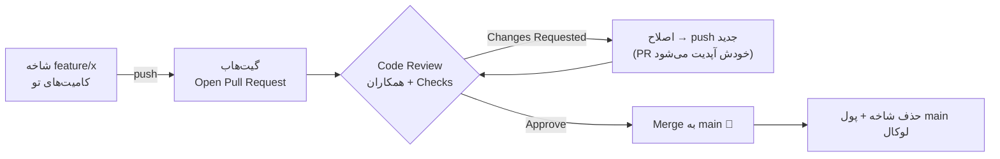

# فصل ۱۱ — Pull Request: قلب همکاری در گیت‌هاب

> 🎯 **هدف:** PR رو از «دکمه‌ای که می‌زنم» به «فرایند حرفه‌ای بازبینی و ادغام» تبدیل کنی: چطور PR خوب بنویسی، ریویو بگیری و ریویو بدی، و سه استراتژی merge گیت‌هاب چه فرقی دارن. این فصل، مهم‌ترین مهارت تو برای کار در شرکت است.

---

## ۱۱.۱ — PR اصلاً چیست؟

**Pull Request = درخواستِ «کدم رو به main اضافه کنید».** یک صفحه گفتگو درباره شاخه‌ت که شامل:

- **diff کامل** تغییرات تو نسبت به main
- توضیحات تو (چرا؟ چطور؟ چطور تست شد؟)
- **ریویو همکاران** (کامنت، درخواست تغییر، تأیید)
- **Checks** — تست‌های خودکار (فصل ۱۵)
- دکمه نهایی: **Merge**

نامش از قدیم مانده: «درخواستِ pull» — یعنی از maintainer می‌خوای کدت رو pull کنه. (گیت‌هاب رابطش رو «Pull Request» می‌نامد؛ گیت‌لب: Merge Request — همون چیزیه.)



> 💡 نکته‌ای که خیلی‌ها نمی‌دونن: **PR شاخه رو دنبال می‌کنه، نه snapshot.** بعد از باز شدن PR، هر push جدید به همون شاخه، خودکار به PR اضافه می‌شه — برای اصلاح نیازی به PR جدید نیست!

## ۱۱.۲ — چرخه کامل: از کد تا merge

```bash
# (از فصل ۱۰) شاخه‌ات push شده:
git push -u origin fix/invoice-total
```

حالا روی گیت‌هاب:
1. بالای صفحه بنر زرد **Compare & pull request** ظاهر می‌شه (یا: تب Pull requests → New → انتخاب base: `main` ← compare: `fix/invoice-total`)
2. **عنوان و توضیحات** بنویس (بخش ۱۱.۳)
3. **Reviewers** رو تعیین کن (اگه CODEOWNERS تنظیم شده باشه خودکار میاد — پایین‌تر)
4. Submit → منتظر ریویو و سبز شدن Checks

### ریویو اومد — «Changes requested»

عادی‌ترین اتفاق دنیاست؛ ناراحت نشو، این یعنی ریویو واقعی انجام شده:

```bash
# اصلاح کن (روی همان شاخه!):
git switch fix/invoice-total
# ... تغییرات ...
git add -p && git commit -m "fix: address review - handle null coupon"
git push                 # ← PR خودش آپدیت می‌شود؛ چیزی لازم نیست
# به همکارت در کامنت‌ها Reply بده و Resolve بزن
```

بعد از merge:

```bash
git switch main
git pull
git branch -d fix/invoice-total
git push --delete origin fix/invoice-total   # یا دکمه Delete branch در گیت‌هاب
```

## ۱۱.۳ — PR خوب بنویس (هنر نیمه‌ی ماجراست)

ریویوچی وقت نداره. PR تو باید در ۳۰ ثانیه «چرا و چی» رو برسونه:

**قانون‌ها:**
- **کوچک!** ~۲۰۰-۴۰۰ خط diff ماکس. PR بزرگ = ریویوی سطحی یا هیچ. کار بزرگ رو به چند PR بشکن.
- یک موضوع — قاطی نکن فیکس و ریفاکتور و فیچر
- خودت رو جای ریویوچی بذار: «بدون توضیح تو، متوجه می‌شه؟»

**قالب توضیحات (همینو کپی کن):**

```
## چه چیزی
فیکس گرد کردن مبلغ کل فاکتور در حالت اعشار (ای شو #142).

## چرا
تا حالا total با round ساده گرد می‌شد و در پرداخت‌های تقسیطی
تا ۱ تومان اختلاف تولید می‌کرد (اسکرین‌شات در تیکِت).

## چطور تست شد
- تست واحد جدید: `invoice-total.spec.ts` (۴ case جدید) ✅
- تست دستی روی محیط staging با سفارش واقعی تقسیطی

## ریسک/نکته برای ریویو
متد `calcTotal` در `billing.ts` رفتارش کمی عوض شده — فایل‌های
`invoice.ts` و `payment.ts` هم مصرف‌کننده‌ان، نگاهی بندازید.
```

عنوان PR = پیام کامیت اصلی: `fix(invoice): round totals correctly (closes #142)`

## ۱۱.۴ — سمت دیگر: ریویو دادن

تو هم زودتر از فکرت در موقعیت ریویو دهنده قرار می‌گیری. آدابش:

**برای نویسنده (از دید ریویوچی):**
| بایست | نبایست |
|---|---|
| روی کد نظر بده نه آدم | «چرا اینو اینجوری نوشتی؟!» با لحن حمله |
| سوال بپرس: «اینجا اگر coupon=null باشه چی می‌شه؟» | تحمیل سلیقه شخصی بدون دلیل فنی («من همیشه این مدلی می‌نویسم») |
| مشخص کن: Nit (جزئی) یا Blocking (الزامی) | «LGTM» بدون خوندن |
| در ۲۴ ساعت جواب بده | هفته‌ها نگه داری و PR استیل شه |

> 💡 قاعده طلایی ریویو: «**سخت‌گیر روی کد، مهربان با آدم.**» و به عنوان نویسنده: ریویو خوردن = gift، نه حمله. بهترین دولوپرها بیشتر از همه ریویو می‌گیرن چون PR های بیشتری می‌زنن.

کامنت‌های گیت‌هاب با `suggestion block` امکان اعمال یک‌کلیکی پیشنهاد رو می‌دن — ازشون استفاده کن وقتی ریویو می‌دی.

## ۱۱.۵ — سه استراتژی Merge گیت‌هاب

وقتی PR تأیید شد، دکمه merge سبز می‌شه — ولی گیت‌هاب سه تا دکمه داره (طبق تنظیمات مخزن):

| دکمه | کاری که می‌کنه | تاریخچه حاصل | مناسب |
|---|---|---|---|
| **Create a merge commit** | کامیت merge با همه کامیت‌های شاخه | درخت واقعی + گراف شلوغ | تیم‌هایی که تاریخچه واقعی می‌خوان |
| **Squash and merge** ⭐ | همه کامیت‌های شاخه → **یک کامیت تمیز** در main | main خطی و خوانا | اکثر تیم‌های مدرن |
| **Rebase and merge** | کامیت‌ها یکی‌یکی روی main (بدون کامیت merge) | خطی، ولی کامیت‌های wip هم می‌مونن | شاخه‌هایی که خودشون تمیز بودن |

با squash، تمام `wip` ها و typo-fix های تو به یک کامیت: `fix(invoice): round totals correctly (#201)` تبدیل می‌شه. به همین دلیل خیلی تیم‌ها «شاخه آزادانه کار کن، main همیشه تمیز» رو با squash پیاده می‌کنن — و در فصل ۸ گفتیم قانون طلایی rebase هم با این مدل سازگارتره.

**سوال روز اول شرکت: «PR ها رو squash merge می‌کنید یا merge commit؟»** جوابش، کل تاریخچه‌ی آینده مخزن رو تعیین می‌کنه.

## ۱۱.۶ — حفاظت‌ها: Rulesets و CODEOWNERS

main در شرکت‌ها **protected** است — نمی‌تونی مستقیم push کنی. ابزار مدرن گیت‌هاب: **Rulesets** (جایگزین جدید Branch Protection):

- مجاز نبودن push مستقیم به main (همه‌چیز از PR بگذره)
- الزام حداقل ۱-۲ Approval
- الزام سبز بودن Checks (تست‌ها)
- الزام شاخه به‌روز با main قبل merge

و **CODEOWNERS** — فایلی که تعیین می‌کنه ریویو کی الزاوریه:

```bash
# .github/CODEOWNERS
*                      @team-backend          # کل مخزن: تیم بک
/src/ui/               @team-frontend         # مسیر UI: تیم فرانت
/payment/              @security-lead         # پول = چشم لید امنیت
```

وقتی فایلی از این مسیرها در PR تغییر کنه، owner هاش خودکار reviewer می‌شن و بدون approve شون merge نمی‌شه.

## ۱۱.۷ — Issue: برگه‌ی کارها، باگ‌ها و گفتگوها 🎫

قبل از کد، همیشه یک «قرارداد» وجود داره: قراره دقیقاً چی حل بشه؟ در گیت‌هاب این قرارداد **Issue** نام داره — لیست کارهای مخزن:

- **باگ گزارش کن** («با کد تخفیف `SALE50`، سبد خرید عدد منفی می‌شه») — با قدم‌های بازتولید و اسکرین‌شات
- **فیچر پیشنهاد بده**، **سوال بپرس**، برای هر کار یک Issue جدا
- هر Issue یک شماره می‌گیره: `#142` — این شماره در کل گیت‌هاب آدرس‌پذیره (هر جا بنویسی `#142` لینک می‌شه)
- با **Labels** دسته‌بندی کن (`bug`، `enhancement`، `good first issue`)، **Assignee** مشخص کن، و در **Projects** بورد کنترل (کانبان) بچین

### اتصال Issue به کامیت و PR — جایی که گیت‌هاب جادویی می‌شه

در پیام کامیت یا توضیحات PR این کلیدواژه‌ها رو بنویس و شماره Issue رو بده:

```bash
git commit -m "fix(cart): clamp total to zero when coupon exceeds amount

Fixes #142"
```

| کلیدواژه | اثر بعد از merge شدن PR به شاخه پیش‌فرض |
|---|---|
| `Fixes #142` / `Closes #142` / `Resolves #142` | Issue **خودکار بسته** می‌شه و به PR لینک می‌شه |
| `Refs #142` / `#142` | فقط لینک و ردیابی — بسته نمی‌شه |

از این به بعد «کد بدون شرح» نداری: هر تغییر به یک Issue وصله، تاریخچه‌ی Issue هم به کامیت‌ها و PR مربوطه لینک داره — کل ماجرا از «چرا این کد اینجوریه؟» تا «کِی فیکس شد؟» یک کلیک فاصله داره.

> 💡 **شروع اوپن‌سورس:** مخزن‌های بزرگ برای تازه‌واردها Label با اسم `good first issue` می‌ذارن. یک Issue آسون بردار، فورک کن (فصل ۱۰)، فیکس کن، PR بزن و در توضیحاتش بنویس `Fixes #123` — اولین مشارکت جهانی‌ات همین‌قدر نزدیکه.

## ✅ جمع‌بندی فصل

- PR = درخواست ادغام + گفتگوی ریویو + checks؛ **شاخه رو دنبال می‌کنه** — push جدید = آپدیت خودکار
- PR خوب: کوچک، تک‌موضوع، با قالب «چه/چرا/چطور تست شد»
- ریویو: سخت روی کد، مهربان با آدم؛ به عنوان نویسنده، ریویو = هدیه
- سه merge گیت‌هاب: merge commit / **squash** / rebase — بپرس تیم کدوم رو می‌خواد
- main معمولاً با Rulesets محافظت می‌شه؛ CODEOWNERS ریویوی الزامی رو خودکار می‌کنه
- Issue = لیست کارهای مخزن؛ `Fixes #142` در کامیت/PR یعنی بعد از merge، ایشو خودکار بسته می‌شه
- بعد از merge: پول main، حذف شاخه، و شروع تمیز بعدی

## 📝 تمرین فصل ۱۱ (کامل‌ترین تمرین دوره — حتماً انجامش بده!)

1. روی یکی از پروژه‌های خودت یک بهبود کوچیک واقعی پیدا کن (مستندات، refactor کوچیک، فیکس).
2. شاخه بزن، ۲-۳ کامیت بزن (حتی یکی wip)، push کن، و PR با قالب بخش ۱۱.۳ باز کن.
3. **خودت ریویو بده:** در تب Files changed، حداقل ۳ کامنت واقعی بذار (یکی suggestion block).
4. اصلاح کن، push کن، Resolve کن، و با **Squash and merge** ادغامش کن.
5. در توضیحات PR یک Issue هم بساز (`Fixes #1`) و ببین بعد از merge، ایشو خودکار بسته می‌شه.
6. برگرد لوکال: pull، حذف شاخه، `git lg` — به تمیزی main نگاه کن. این چرخه رو تا وقتی «عادی» حسش کنی روی پروژه‌های دیگه‌ت تکرار کن.

➡️ **فصل بعد:** گردش‌کارهای تیمی — GitHub Flow، Git Flow و trunk-based؛ و اینکه هر شرکت کدوم رو می‌خواد.
