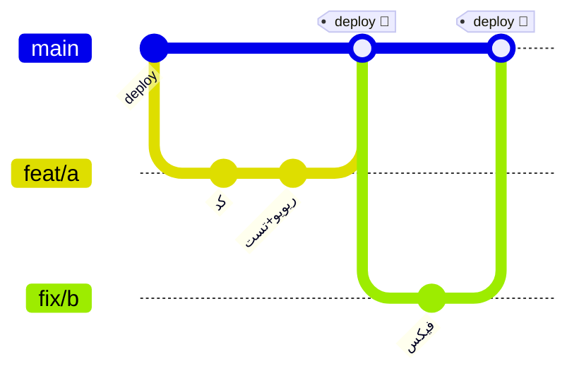
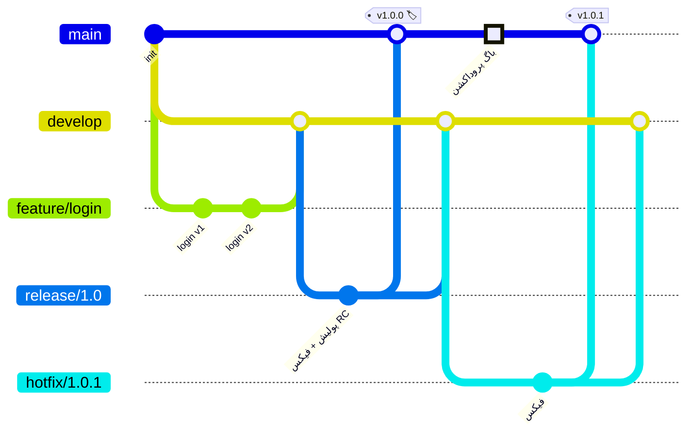

# فصل ۱۲ — گردش‌کارهای تیمی: وقتی «تیم» وارد ماجرا می‌شود

> 🎯 **هدف:** در شرکت‌ها، گیتِ «هر کی هر جور دوست داره» وجود نداره — یک **workflow قراردادی** هست. سه گردش‌کار استاندارد صنعت رو یاد می‌گیری تا روز اول استخدام بدونی پیش روته، و برای تیم‌ت هم بتونی انتخاب کنی.

---

## ۱۲.۱ — GitHub Flow: ساده و مدرن ⭐

ساده‌ترین گردش‌کاری که اکثر استارتاپ‌ها و محصولات وب مدرن (خود GitHub هم!) استفاده می‌کنن:



**قوانین (فقط ۵ تا!):**
1. `main` همیشه **deploy-پذیر** است — هر کامیتش قابل انتشار
2. هر کار جدید = شاخه جدید از main
3. کامیت‌ها + push منظم (نه «تموم شد بعد push»)
4. **Pull Request** = دروازه merge (ریویو + checks)
5. بعد از merge → deploy → شاخه پاک

- ✅ مزیت: ساده، سریع، کاملاً PR-محور — برای CI/CD مداوم عالیه
- ❌ ضعف: نسخه‌های موازی (مثلاً «نسخه موبایل ۱.x و ۲.x باهم پشتیبانی می‌شن») رو سخت می‌کنه

**برای چه کسی:** SaaS، وب‌اپ، هر جا deploy پیوسته داره → انتخاب پیش‌فرض مدرن.

## ۱۲.۲ — Git Flow: سنگین‌تر، برای ریلیزهای برنامه‌ریزی‌شده

گردش‌کار کلاسیک با دو شاخه دائمی و چند شاخه موقت:



| شاخه | دائمی؟ | نقش |
|---|---|---|
| `main` | ✅ | فقط نسخه‌های منتشرشده — هر کامیت یک tag |
| `develop` | ✅ | حلقه ادغام فیچرها |
| `feature/*` | موقت | کار جدید از develop |
| `release/*` | موقت | آماده‌سازی نسخه: پولیش، bump نسخه، فیکس RC |
| `hotfix/*` | موقت | فیکس فوری از main → برگشت به main و develop |

- ✅ مزیت: مدیریت چند نسخه موازی، ریلیزهای برنامه‌ریزی‌شده — برای اپ موبایل/دسکتاپ که نسخه‌ها «زنده» می‌مونن
- ❌ ضعف: سنگین و پرآیین — برای وب‌سایت‌های معمولی overkill

**برای چه کسی:** اپ‌های با ریلیز نسخه‌ای (موبایل، دسکتاپ، embedد)، تیم‌های بزرگ با چرخه release مشخص.

## ۱۲.۳ — Trunk-Based Development: سبک شرکت‌های بزرگ

سبک غالب شرکت‌های مقیاس‌بزرگ (Google و مشابه‌ها): **همه به یک trunk (main) خیلی کوچک و سریع کامیت می‌زنن:**

- شاخه‌ها **کوتاه‌عمر** (چند ساعت/چند روز max)، ادغام‌های مکرر
- فیچر ناتمام؟ **Feature Flags** — کد merge می‌شه ولی با فلگ خاموش deploy می‌شه
- به جای شاخه‌های بلند و merge های فاجعه‌بار، ادغام‌های مکررِ کوچیک

```bash
# شاخه کوتاه، merge سریع:
git switch -c quick-fix && # ... ۱-۲ کامیت ...
git push && gh pr create --fill    # فوری PR
# فیچر بزرگ؟ تکه‌تکه (مثل برگر)، نه یک ماموت:
# هر PR = یک تکه قابل‌ریویو که با فلگ خاموشه
```

- ✅ مزیت: ادغام مداوم = تعارض‌های کوچیک و نادر؛ سرعت تیم‌های بزرگ
- ❌ نیازمند بلوغ: تست‌های خودکار قوی، CI خوب، فرهنگ ریویو سریع

## ۱۲.۴ — جدول انتخاب (و اینکه در واقعیت با چی روبه‌رو می‌شی)

| | GitHub Flow | Git Flow | Trunk-Based |
|---|---|---|---|
| شاخه‌های دائمی | main | main + develop | main |
| شاخه‌ی کار | از main، عمر متوسط | از develop، عمر بلندتر | کوتاه‌عمر + فلگ |
| deploy | هر merge | با tag ریلیز | مداوم (چند بار در روز) |
| مناسب | وب/SaaS ⭐ | اپ نسخه‌ای | تیم بزرگ/بلوغ بالا |
| پیچیدگی | کم ⭐ | زیاد | متوسط (نیاز به زیرساخت) |

> 💡 **واقعیت بازار کار:** اکثر شرکت‌های ایرانی و استارتاپ‌ها **GitHub Flow + squash merge** دارن. اگه بپرسی «workflow گیت‌تون چیه؟» و جوابش روشن بود، یعنی تیم آگاهیه؛ اگه نه، تو با دانش این فصل می‌تونی کمکی کنی — و این نشونه‌ی بلوغه.

## ۱۲.۵ — عرف‌های تیمی که باید ازشون باخبر شی (چک‌لیست روز اول)

```text
□ main مستقیم push می‌شه یا protected و فقط PR؟
□ استراتژی merge: squash / merge commit / rebase-and-merge؟
□ قرارداد نام شاخه: feature/*، fix/*، user/initials؟
□ قالب کامیت: Conventional Commits؟ لینک به تیکِت (JIRA/Trello) الزامی؟
□ حداقل چند Approve لازمه؟ CODEOWNERS دارن؟
□ Checks الزامی چی‌ان (lint/test/build)؟
□ نسخه/ریلیز چطور انجام می‌شه (tag/release/CI)؟
```

این ۸ سوال رو روز اول بپرس — سطح آمادگی‌ت رو بالاتر از انتظارشون نشون می‌ده و استرس «نمیدونم انتظارات چیه» رو می‌کشه.

---

## ✅ جمع‌بندی فصل

- **GitHub Flow**: main همیشه deploy-پذیر؛ همه‌چیز از PR رد می‌شه — پیش‌فرض مدرن
- **Git Flow**: main+develop + feature/release/hotfix — برای نسخه‌های موازی
- **Trunk-Based**: شاخه کوتاه + Feature Flags — سبک شرکت‌های بزرگ
- deploy-پذیری main، ریویو و CI، استراتژی merge = تصمیم‌های کلیدی هر workflow
- چک‌لیست ۸ سوال روز اول = واکسن استرس

## 📝 تمرین فصل ۱۲

1. برای یکی از پروژه‌های خود یک فایل راهنما تدوین کرده و **بنویسید** (فایل `CONTRIBUTING.md`): کدوم workflow، قالب شاخه، قالب کامیت، استراتژی merge. نوشتنش خودش نصف بلوغه!
2. شبیه‌سازی تیمی: دو شاخه فیچر همزمان بساز که هر دو فایل مشترکی رو تغییر بدن؛ اولی رو merge کن، دومی رو با اولی sync کن (`rebase`) و تعارض رو حل کن — دقیقاً همون حس کار تیمی.
3. یکی از مخزن‌های معروف گیت‌هاب رو باز کن (مثلاً nextjs) → تب Pull Requests → ۳ PR تازه رو ببین: workflow‌شون چیه؟ ریویو‌ها چطور نوشته شدن؟ (بخونی روحیه تیم‌های واقعی.)

<details><summary>راهنمای تمرین ۱ (نمونه CONTRIBUTING.md)</summary>

```
# Contributing
- Workflow: GitHub Flow — main همیشه deploy-پذیر
- Branches: `feat/<scope>` | `fix/<scope>` | `docs/<scope>`
- Commits: Conventional Commits (feat/fix/chore/docs/...)
- PRs: کوچک، تک‌موضوع، با توضیح «چه/چرا/تست»، حداقل ۱ approval
- Merge: squash and merge
```
</details>

➡️ **فصل بعد:** کتاب نجات — ۱۵ سناریوی «اوپس» با راه‌حل دقیق. کتابی که می‌خوای همیشه کنارت باشه.
