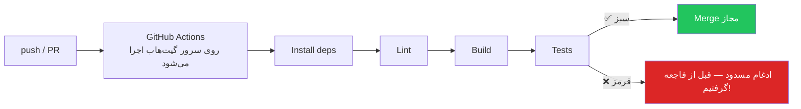

# فصل ۱۵ — GitHub Actions و ابزارهای حرفه‌ای دور گیت

> 🎯 **هدف:** یاد بگیری CI (یکپارچه‌سازی پیوسته) چیه و یک workflow واقعی روی مخزن خودت راه بندازی، با ابزارهایی که پروژه‌های حرفه‌ای رو «حرفه‌ای» می‌کنن: Checks سبز، Badges، Dependabot و امضای کامیت.

---

## ۱۵.۱ — CI چیست و چرا در همه شرکتی هست؟

**CI (Continuous Integration)** یعنی: با هر push و هر PR، **ماشین‌ها به‌جای انسان** چک‌های خودکار را اجرا کنند — build، lint، تست‌ها. نتیجه: کد خراب *قبل* از رسیدن به main گرفته می‌شه، نه بعد از deploy در ساعت ۲ بامداد.



در PR فصل ۱۱ دیدی: **Checks** همون خروجی CI است. در شرکت‌ها merge تا سبز شدن checks قفل می‌مونه.

## ۱۵.۲ — اولین Workflow روی مخزن خودت

GitHub Actions = موتور اجرای خودکار گیت‌هاب. دستور کارها در فایل‌های **YAML** داخل پوشه `.github/workflows/` مخزن نوشته می‌شن.

یک workflow واقعی برای یک پروژه Next.js/Node بساز — فایل `.github/workflows/ci.yml`:

```yaml
name: CI

on:
  push:
    branches: [main]
  pull_request:          # روی همه PRها

jobs:
  test:
    runs-on: ubuntu-latest     # ماشین مجازی تمیز برای هر اجرا
    steps:
      - uses: actions/checkout@v4        # اکشن آماده: کد مخزن را clone کن

      - uses: actions/setup-node@v4
        with:
          node-version: 22
          cache: npm

      - run: npm ci                      # نصب تمیز و دقیق طبق package-lock
      - run: npm run lint
      - run: npm run build
      - run: npm test
```

خط‌به‌خط بفهم:

| بخش | معنی |
|---|---|
| `name: CI` | اسم workflow (نمایش در تب Actions) |
| `on: push / pull_request` | رویدادهای ماشه |
| `jobs` | هر job روی یک ماشین مجازی تازه اجرا می‌شه (موازی) |
| `steps` | ترتیب کارها؛ `uses:` = اکشن آماده دیگران، `run:` = دستور شل |
| `actions/checkout@v4` | بدون این، ماشین هیچ کدی نداره! اولین step تقریباً همیشه همینه |

بعد:

```bash
mkdir -p .github/workflows
# فایل را بساز و:
git add .github && git commit -m "ci: add lint, build and test workflow"
git push
```

برو به مخزن → تب **Actions** — اجرای زنده رو ببین: هر step با لاگ کاملش. بعد از این، در PR ها بخش **Checks** سبز/قرمز می‌شه.

> 💡 نکته فرانت‌کار: این دانش مستقیماً قابل فروش است. «CI راه می‌ندازم» جمله‌ای است که در مصاحبه وزن داره و در عمل، ۹۰٪ پروژه‌ها فقط به همین ۱۲ خط یامل نیاز دارن.

## ۱۵.۳ — Badges: نشان‌های وضعیت روی README

آن آیکون‌های کوچیک بالای README پروژه‌ها (build status، نسخه، لایسنس):

```

```

از صفحه Actions روی workflow خودت، دکمه «...» → **Create status badge** — کد آماده‌ش رو کپی کن بالای README. نشان سبز = «این پروژه نگهداری می‌شه» به چشم هر بازدیدکننده‌ای (و مصاحبه‌گری).

## ۱۵.۴ — Dependabot: نگهبان وابستگی‌ها

دیپندنسی‌های قدیمی = حفره امنیتی. Dependabot (داخل خود گیت‌هاب) به‌صورت دوره‌ای PR های آپدیت خودکار باز می‌کنه:

فعال‌سازیش با فایل `.github/dependabot.yml`:

```yaml
version: 2
updates:
  - package-ecosystem: npm        # برای npm / pnpm: npm
    directory: "/"
    schedule:
      interval: weekly
  - package-ecosystem: github-actions
    directory: "/"
    schedule:
      interval: weekly
```

بعدش هفته‌ای چند PR می‌بینی با عنوان `Bump next from 15.x to 15.y` — صرفاً merge کن (checks سبزه) یا نگاهی بنداز. در شرکت هم معمولاً Dependabot یا ابزار مشابه (Renovate) روشنه — پس چیز غریبه‌ای نیست.

## ۱۵.۵ — امنیت کامیت: امضای دیجیتال (Signed Commits)

چرا کنار بعضی کامیت‌ها علامت «Verified» هست؟ چون با کلید GPG/SSH **امضا** شدن — یعنی واقعاً از سیستم صاحب اکانت اومدن، نه کسی که اسم و ایمیلش رو جعل کرده (چون تنظیم `user.name/email` برای هرکس ممکنه!).

فعال‌سازی با SSH (ساده‌ترین راه مدرن):

```bash
# از همون کلید SSH فصل ۲ برای امضا استفاده کن:
git config --global gpg.format ssh
git config --global user.signingkey ~/.ssh/id_ed25519.pub
git config --global commit.gpgsign true

# کلید عمومی را در گیت‌هاب اضافه کن:
# Settings → SSH and GPG keys → New SSH key → Key type: Signing Key
```

از این به بعد کامیت‌هات روی گیت‌هاب **Verified** می‌شن — جزئیات کوچیکی که پروفایل حرفه‌ای رو می‌سازه (و در شرکت‌های امنیت‌محور گاهی الزامی است).

## ۱۵.۶ — ابزارهای مکملی که تو اکوسیستم می‌بینی (شناختی، نه تسلط)

| ابزار | چیست | چرا اسمش را می‌شنوی |
|---|---|---|
| **GitLens** | افزونه VS Code: تاریخچه/blame فوق‌حرفه‌ای داخل ادیتور | نصبش کن — مال روز اول است |
| **Husky + lint-staged** | گیت هوک‌ها در پروژه‌های JS: قبل از هر کامیت، lint/format خودکار | در اکثر پروژه‌های شرکتی نصبه — وقتی کامیت می‌زنی و «auto-fix» اجرا می‌شه، اینه |
| **git-flow / gh-cli** | افزونه شاخه‌بندی / CLI رسمی گیت‌هاب (`gh pr create` و...) | `gh` رو نصب کن؛ ساخت PR از ترمینال رایجه |
| **CodeSandbox/Codespaces** | VS Code ابریِ متصل به مخزن | دکمه سبز «Code → Codespaces» در مخزن‌ها |
| **Secret scanning / push protection** | گیت‌هاب جلوی push کردن کلید لو رفته رو می‌گیره | اگه روزی push رد شد با پیام secret، خونه‌ای — داره نجاتت می‌ده |

نمونه `gh` — ساخت PR بدون باز کردن مرورگر:

```bash
gh auth login                          # یک بار
gh pr create --fill                    # عنوان/توضیح از کامیت‌ها
gh pr checks                           # وضعیت checks
gh pr merge --squash --delete-branch   # ادغام + حذف شاخه، همه از ترمینال
```

## ۱۵.۷ — نگهداری حرفه‌ای مخزن (چک‌لیست پروژه بالغ)

- [ ] README با بخش‌های: چی هست / نصب / اجرا / ساختار پوشه‌ها
- [ ] Badge های CI و لایسنس
- [ ] `.gitignore` + `.env.example` (بدون مقدار واقعی)
- [ ] CI workflow سبز روی هر PR
- [ ] Dependabot روشن
- [ ] Releases با تگ semver + release notes (فصل ۹)
- [ ] قالب PR و ایشو (`.github/pull_request_template.md` و `ISSUE_TEMPLATE`)
- [ ] امضای کامیت‌ها (Verified)

این چک‌لیست استانداردهای مهندسی را روی پروژه‌های خود پیاده‌سازی کنید تا مخزن‌ها از وضعیت صرفاً «کد ذخیره‌شده» به یک «محصول مهندسی‌شده و استاندارد» ارتقا پیدا کنند؛ این همان الگویی است که تیم‌های حرفه‌ای در بررسی‌های فنی انتظار دارند.

---

## ✅ جمع‌بندی فصل

- CI = چک‌های خودکار روی هر push/PR؛ در گیت‌هاب با **GitHub Actions** و YAML داخل `.github/workflows/`
- ساختار حداقلی: `on` (ماشه) + `jobs` + `steps` (`uses` اکشن آماده، `run` شل)؛ `actions/checkout` تقریباً همیشه اولین step
- Checks سبز = شرط merge در شرکت‌ها؛ Badge = تبلیغ زنده سلامت پروژه
- Dependabot آپدیت وابستگی‌ها را PR خودکار می‌کند؛ push protection جلوی لو رفتن رازها را می‌گیرد
- `gh` CLI و GitLens و Husky = ابزارهای روزمره‌ای که در شرکت‌ها همه‌جا هستن
- Signed commits = تیک Verified روی کارت ویزیت حرفه‌ای‌ات

## 📝 تمرین فصل ۱۵

1. روی یکی از پروژه‌های خود، فایل `ci.yml` این فصل را پیاده‌سازی و push کنید. تب Actions را ببین — سبز شد؟ (اگه تست نداری، فقط lint و build نگه دار.)
2. Badge ساخته‌شده را بالای README بگذار.
3. `dependabot.yml` را اضافه کن و یک هفته بعد به PR های بازشده سر بزن.
4. `gh` CLI را نصب و `gh auth login` کن؛ بعد یک PR را کاملاً از ترمینال بساز و merge کن.
5. (اختیاری ⭐) امضای SSH کامیت‌ها را فعال کن و تیک Verified را ببین.

<details><summary>عیب‌یابی سریع CI</summary>

- «nothing to run»: مسیر فایل حتماً `.github/workflows/*.yml` باشد
- قرمز روی `npm ci`: `package-lock.json` را commit کرده‌ای؟ (اگر npm استفاده می‌کنی، lock file باید در مخزن باشد)
- قرمز روی build: اول خودت لوکال `npm run build` بزن — CI فقط همون را تکرار می‌کند
- لاگ هر step را باز کن؛ پیام خطا تقریباً همیشه خودگویاست
</details>

➡️ **فصل آخر:** چیت‌شیت‌ها، گلاساری و ۲۰ سوال مصاحبه با جواب کوتاه.
