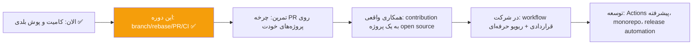

# فصل ۱۶ — چیت‌شیت، گلاساری و ۲۴ سوال مصاحبه

> 🎯 **هدف:** مرجع مرور سریع — روی دیوار اتاقت، کنار مانیتورت، و شب قبل از مصاحبه.

---

## ۱۶.۱ — چیت‌شیت دستورات گیت

```bash
# ═══ شروع ═══
git init                          # مخزن جدید
git clone <url>                   # کپی مخزن ریموت
git status / git st               # وضعیت (دستور -sb خلاصه)

# ═══ ثبت ═══
git add file / git add -p         # به سبد (تکه‌تکه با -p)
git mv old new                    # جابه‌جایی/تغییر نام زیر نظر گیت
git rm file / git rm --cached f   # حذف (از دیسک+مخزن / فقط مخزن)
git commit -m "msg"               # ثبت
git commit --amend                # اصلاح آخرین (فقط قبل از push!)
git restore file                  # برگشت ویرایش‌ها (⚠️ پاک می‌کند)
git restore --staged file         # فقط unstage

# ═══ دیدن ═══
git lg                            # (alias) گراف همه شاخه‌ها
git diff / diff --staged / diff HEAD
git show <sha>                    # جزئیات یک کامیت
git log --author="Ali" --since="2 weeks ago"
git log -S "apiKey" --oneline     # pickaxe: شکار رشته در تغییرات
git log main..feature/x           # کامیت‌هایی که شاخه ویژگی به شاخه اصلی اضافه می‌کند
git blame -L 10,20 -- src/app.js  # هر خط، کدوم کامیت
git shortlog -sn                  # آمار کامیت هر نفر

# ═══ شاخه ═══
git switch -c feature/x           # ساخت + پرش
git switch -                      # شاخه قبلی
git merge feature/x               # ادغام (تعارض: حل → add → commit)
git branch -d / -D name           # حذف امن / اجباری

# ═══ تاریخچه تمیز ═══
git rebase main                   # انتقال کامیت‌های شاخه جاری روی نوک main
git rebase -i HEAD~4              # جراحی: squash/fixup/reword/drop
git cherry-pick <sha>             # نقل یک کامیت
# ⚠️ بازنویسی فقط روی شاخه شخصی؛ مشترک → revert

# ═══ ریموت ═══
git fetch                         # فقط دانلود (امن)
git pull --rebase                 # دانلود + خطی ادغام
git push -u origin branch         # اولین push + جفت‌سازی
git push --force-with-lease       # فقط شاخه شخصی!
git remote -v / add / set-url

# ═══ نجات ═══
git reflog                        # ژورنال HEAD — نجات هر چیز
git reset --soft/mixed/--hard HEAD~1
git revert <sha>                  # خنثی‌سازی امن (مشترک)
git stash / pop / list / apply
git merge --abort / rebase --abort
git clean -n / -fd                # dry-run / حذف untracked
git bisect start                  # شکار کامیت معرفی‌کننده باگ

# ═══ زیر پوست ═══
git cat-file -t / -p <sha>        # نوع / محتوای یک آبجکت
git ls-tree HEAD [dir]            # محتوای یک tree (پوشه)
git rev-parse main                # SHA کامل شاخه
git count-objects -vH             # آمار و حجم مخزن
git gc                            # فشرده‌سازی و پاکسازی

# ═══ هوک‌ها (فصل ۱۴) ═══
ls .git/hooks/                    # نمونه‌های فعال‌نشده (.sample)
chmod +x .git/hooks/pre-commit    # فعال‌سازی در Git Bash
git commit --no-verify            # پرش از هوک (فقط در اضطرار!)
npx husky init                    # هوک نسخه‌بندی‌شده برای تیم (JS)

# ═══ نسخه ═══
git tag -a v1.2.0 -m "msg" && git push origin v1.2.0
```

## ۱۶.۲ — چیت‌شیت Conventional Commits

```
feat: فیچر جدید          → MINOR (0.x.0)
fix: رفع باگ             → PATCH (0.0.x)
refactor / perf / test / docs / chore / style
BREAKING CHANGE یا !     → MAJOR (x.0.0)

feat(payments): add refund webhook
fix(auth): prevent double submit on slow network
refactor(api)!: change response shape    ← ! = breaking

قالب PR: «چه / چرا / چطور تست شد»
```

## ۱۶.۳ — گلاساری فارسی–انگلیسی

<div class="longtable" markdown="1">

| انگلیسی | فارسی | یک جمله |
|---|---|---|
| Repository (Repo) | مخزن | پوشه‌ای که تاریخچه گیت دارد |
| Commit | کامیت / ثبت | snapshot با شناسه و پیام |
| Staging Area | ناحیه آماده‌سازی | سبد خرید کامیت بعدی |
| Branch | شاخه | اشاره‌گر متحرک به یک کامیت |
| Merge | ادغام | ترکیب دو خط تاریخچه |
| Conflict | تعارض | دو تغییر ناسازگار روی یک خط — سوال، نه ارور |
| Rebase | بازپایه‌گذاری | کندن کامیت‌ها و بکار دوباره روی نوک شاخه دیگر |
| Remote | ریموت / مخزن دور | آدرس نسخه ابری (origin) |
| Push / Pull / Fetch | ارسال / کشیدن / دریافت | ارسال کامیت‌ها / دانلود+ادغام / فقط دانلود |
| Fork | انشعاب | کپی مخزن دیگران در اکانت خودت |
| Pull Request (PR) | درخواست ادغام | گفتگوی بازبینی قبل از merge |
| Code Review | بازبینی کد | چشم دوم روی تغییرات |
| HEAD | — | «الان کجای تاریخچه‌ام» |
| Detached HEAD | HEAD جدا | ایستادن مستقیم روی کامیت، نه شاخه |
| Upstream | بالادست | مخزن اصلی (در رابطه فورک) |
| Tag / Release | برچسب / انتشار | نشانه نسخه رسمی |
| Stash | ذخیره موقت | کمد موقت تغییرات نیمه‌تمام |
| Reflog | — | ژورنال حرکات HEAD — بیمه زندگی |
| Squash | له‌کردن | ادغام چند کامیت در یک کامیت تمیز |
| CI / Pipeline | یکپارچه‌سازی پیوسته | چک‌های خودکار روی هر push/PR |
| Protected branch / Ruleset | شاخه محافظت‌شده | main فقط از دروازه PR |
| Blob / Tree | — | آبجکت محتوای فایل / آبجکت پوشه در دیتابیس `.git` |
| Packfile | بسته | فشرده‌سازی مجموعه آبجکت‌ها (خروجی `git gc`) |
| Hook | قلاب | اسکریپت خودکار در نقاط چرخه گیت (pre-commit و...) |
| Issue | ایشو / کار | برگه باگ/فیچر/سوال — `Fixes #142` بعد از merge می‌بنددش |
| Pickaxe | — | جست‌وجوی یک رشته در تغییرات تاریخچه (`git log -S`) |

</div>

## ۱۶.۴ — ۲۴ سوال رایج مصاحبه (با جواب‌های فشرده)

**۱. گیت و گیت‌هاب چه فرقی دارند؟**
گیت ابزار کنترل نسخه روی سیستم شماست؛ گیت‌هاب سرویس ابری میزبانی مخزن‌ها با قابلیت‌های همکاری (PR، ایشو، CI). مثل فرق Word و Google Docs.

**۲. commit چه اطلاعاتی دارد؟**
Snapshot کامل پروژه + SHA هش‌شده از محتوا + اشاره به کامیت پدر + نویسنده، تاریخ، پیام.

**۳. working directory، staging و repository؟**
میز کار → `add` → سبد کامیت → `commit` → انبار دائمی. add نشده، کامیت نمی‌شود.

**۴. شاخه در گیت واقعاً چیست؟**
یک فایل متنی کوچک حاوی SHA یک کامیت — اشاره‌گر متحرک. برای همین ساختنش رایگان و آنی است.

**۵. فرق merge و rebase؟**
هر دو دو شاخه را ادغام می‌کنند. merge کامیتِ جدیدی با دو والد می‌سازد (تاریخچه واقعی انشعاب). rebase کامیت‌های شاخه را با SHA جدید روی نوک شاخه مبنا بازسازی می‌کند (تاریخچه خطی) — و چون بازنویسی تاریخچه است، فقط روی شاخه‌های محلی/اختصاصی امن است.

**۶. merge conflict چیست و چطور حل می‌شود؟**
دو تغییر ناسازگار روی یک ناحیه از یک فایل. گیت نشان‌های `<<<<<<< ======= >>>>>>>` می‌گذارد؛ تصمیم می‌گیرید (حتی با صاحب کد دیگر)، فایل را اصلاح می‌کنید، add و commit (در rebase: `--continue`).

**۷. فرق reset و revert؟**
reset شاخه را به عقب بازمی‌گرداند (بازنویسی تاریخچه — مخصوص شاخه‌های محلی). revert کامیت معکوس جدید می‌سازد (تاریخچه دست‌نخورده — امن برای شاخه‌های مشترک).

**۸. `git pull` و `git fetch`؟**
fetch فقط دانلود به `origin/*` بدون تغییر کد شما؛ pull = fetch + merge/rebase. حرفه‌ای: اول fetch و نگاه، بعد ادغام.

**۹. `git reset --hard` زدم و کدم رفت!**
`git reflog` بزن؛ SHA حالت قبلی را پیدا و `git reset --hard <SHA>` کن. کامیت‌ها ~۹۰ روز در `.git` زنده‌اند.

**۱۰. force push چیست و کی مجاز است؟**
بازنویسی ریموت با تاریخچه لوکال. فقط روی شاخه‌های شخصی و فقط با `--force-with-lease`. روی main/مشترک هرگز.

**۱۱. HEAD چیست؟ Detached HEAD چیست؟**
HEAD = اشاره‌گر «موقعیت فعلی» (معمولاً نوک شاخه). اگر مستقیم روی یک کامیت باشد (مثلاً بعد از `git switch <sha>`)، detached است — کامیت جدید بی‌خانه می‌شود؛ راه نجات: `git switch -c` از همان‌جا.

**۱۲. Pull Request چیست و چرا در شرکت‌ها الزامی است؟**
درخواست ادغام شاخه به main همراه diff، توضیحات، code review و checks خودکار — دروازه کیفیت: هیچ کدی بدون چشم دوم و تست به main نمی‌رسد.

**۱۳. squash merge چیست و چرا محبوب است؟**
همه کامیت‌های شاخه به یک کامیت تمیز در main تبدیل می‌شوند — main خوانا می‌ماند و wip ها دور ریخته می‌شوند.

**۱۴. cherry-pick کی لازم می‌شود؟**
انتقال یک کامیت مشخص به شاخه دیگر — مثلاً backport فیکس حیاتی از main به شاخه release قدیمی.

**۱۵. fast-forward merge چیست؟**
اگر از لحظه انشعاب، شاخه مبنا ثابت مانده باشد، merge فقط اشاره‌گر را جلو می‌برد و کامیت merge ساخته نمی‌شود — تاریخچه خطی می‌ماند.

**۱۶. tag و release؟**
tag برچسب دائمی روی یک کامیت (نسخه) است — annotated بهتر است؛ release نسخه رسمی گیت‌هابی همان تگ با یادداشت انتشار. semver: MAJOR.MINOR.PATCH.

**۱۷. `.gitignore` کارش چیست و چرا `.env` هرگز نباید commit شود؟**
الگوی فایل‌هایی که گیت نادیده می‌گیرد (فقط untracked ها). `.env` راز‌ها را دارد؛ لو رفتنش یعنی rotate فوری کلید + پاکسازی تاریخچه با filter-repo.

**۱۸. stash چیست و چه فرقی با کامیت موقت دارد؟**
stash تغییرات را به‌صورت پشته موقت کنار می‌گذارد بدون کامیت — برای مانورهای کوتاه (فیکس فوری، pull). کامیت موقت تاریخچه را شلوغ می‌کند؛ stash تمیزتر است ولی فراموش‌شدنی — کارهای بلند = شاخه.

**۱۹. CI چیست؟ (و GitHub Actions؟)**
اجرای خودکار lint/build/test روی هر push/PR. در گیت‌هاب با فایل YAML در `.github/workflows/` تعریف می‌شود؛ خروجی‌اش checks در PR است که معمولاً merge را قفل می‌کنند.

**۲۰. اولین روز کار: workflow گیت تیم را چطور می‌فهمی؟**
می‌پرسی: main محافظت‌شده است؟ استراتژی merge چیست (squash?)؟ قرارداد نام شاخه و کامیت؟ چند approval لازم است؟ checks الزامی؟ — هشت سوال چک‌لیست فصل ۱۲.

**۲۱. گیت فایل‌ها را چطور ذخیره می‌کند؟**
دیتابیس محتوا-محور با هش SHA: چهار آبجکت — blob (محتوای فایل، بدون اسم)، tree (پوشه)، commit (snapshot + والد + پیام) و tag. محتوای یکسان = blob مشترک (dedup)؛ شاخه فقط یک فایل متنی حاوی SHA است.

**۲۲. Git Hook چیست؟ چند نمونه؟**
اسکریپتی که گیت در نقاط چرخه اجرا می‌کند؛ exit غیر صفر = لغو عملیات. `pre-commit` (چک محتوا مثل .env یا lint)، `commit-msg` (اعتبارسنجی پیام Conventional)، `pre-push` (تست قبل از ارسال). هوک‌ها در `.git/hooks` نسخه‌بندی نمی‌شوند — برای تیم: `core.hooksPath` یا Husky؛ و چون قابل رد شدن با `--no-verify` است، اعمال اجباری در CI تکرار می‌شود.

**۲۳. چطور پیدا کنی کدام کامیت یک رشته را وارد کد کرد؟**
`git log -S "apiKey"` (pickaxe) کامیت‌هایی را نشان می‌دهد که تعداد آن رشته را تغییر داده‌اند؛ `-G` با regex. اگر عامل باگ را نمی‌دانی ولی علامتش را می‌دانی: `git bisect` (جست‌وجوی دودویی). برای «این خط را کی نوشته؟»: `git blame` یا GitLens.

**۲۴. `git gc` چه می‌کند و چرا مخزن با هزار کامیت کوچک می‌ماند؟**
آبجکت‌های تکی (loose) را بسته‌بندی و فشرده می‌کند (packfile + delta compression) و آبجکت‌های بی‌مرجع را بعد از مهلت reflog پاک می‌کند. به‌خاطر dedup و delta، هر کامیت فقط «تغییرها» را واقعاً ذخیره می‌کند — snapshot بودن با هزینه دیسک کم سازگار است.

---

## ۱۶.۵ — نقشه راه پس از این دوره



**سه توصیه پایانی:**
1. **چرخه PR را روی پروژه‌های خودت عادی کن** — شاخه، کامیت مرتب، PR با قالب، squash merge. وقتی این چرخه برایت «کار روزمره» شد، در شرکت تازه‌کار نیستی.
2. **زمین تمرین را نابود کن** — هر هفته یک سناریوی فصل ۱۳ را عمداً بساز و نجات بده. ترس فقط با تجربه حادثه می‌میرد.
3. **داکیومنت رسمی را دوست بدار** — [git-scm.com/book](https://git-scm.com/book) (کتاب رسمی Pro Git، رایگان) و [docs.github.com](https://docs.github.com) همیشه به‌روزترین منبع‌اند؛ جزئیات نسخه‌ای این دوره (مثل Git 3.0 در راه) را با آن‌ها چک کن.

موفق باشی — از «کامیت و پوش» تا «آماده تیم»، مسیر رو کامل اومدی. 🚀
